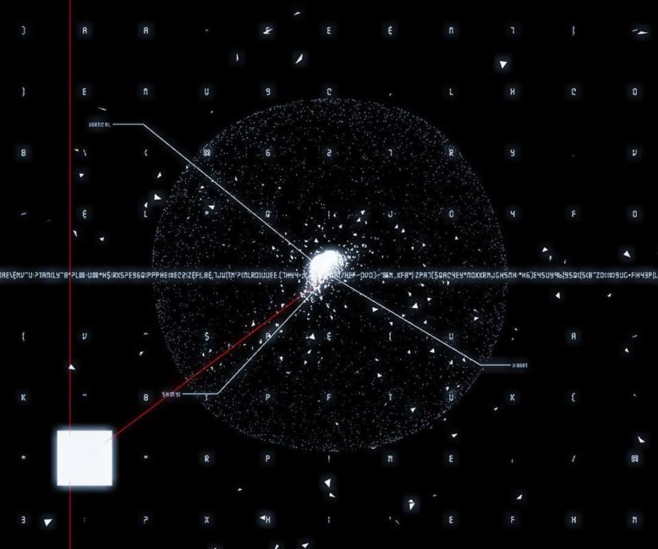

# Digital Cortex

## DCR-TRV30
弟弟終於進了大學。多少受到我的影響，他選擇了北藝大新媒體藝術學系。也因此，他開始接觸攝影、注意身邊許多被淘汰的科技儀器，包括我們家裡面那台許久沒動的手持 [Sony DCR-TRV30](https://www.cnet.com/products/sony-dcr-trv30/specs/) 與裝了一鐵盒的 Mini DV 帶。裡面盛裝的是我們的童年，那些黃黃的、畫面模糊的印象。

大約二十卷左右，最早的拍攝時期是我已經上了小學的年紀，那時候弟弟還在唸幼稚園。因為當時這樣的攝影機已經是最新的影像設備。一天，我與女友在家裡，翻找了一捲捲的錄影帶，看到爸媽年輕的樣貌，想到被藏到心底的遠大夢想，那是他們放在我身上的青春啊！也看到時常欺負弟弟的我，當時候總覺得他小我一截，什麼都不懂，所以容易看不起他。小時候嘴巴停不下來的他，是不是因為我的關係而長大變得不愛說話了？我止不住的流淚，低傳真度的影像變為一個介面，聯結到被壓縮為數位訊號的記憶。

## 腦皮層的義肢

傳統人文主義裡面，人的本質來源是精神上的理性。但在賽伯格與後人類的概念之下，除了理性以外，科技的介入也不斷在形塑人性與精神的樣態。

Mini DV 裡用磁性物質記憶的數位訊號、數位相機儲存於 SD 記憶卡裡面的照片檔案、隨身碟上 EEPROM 記載的文件資料、硬碟內部盤狀結構裡的個人化作業系統、甚至是，所有都可以詮釋為人類精神狀態的衍伸物。數位的記憶載體，實質上就是人類記憶功能的擴增展現，是為一種數位的「義肢」。

## 生命是為資料

所有的展示的物件，都曾經在成長過程中扮演記憶「義肢」的角色，也是概念上賽伯格人的器官。而電腦主機板上的運算核心，是整個數位時代推進的心臟，幾乎成為現代人生命在科技上最終極的延展。因此，所有記憶裝置（DV 帶、記憶卡、硬碟等）都接上配電、水冷與光纖，與核心的一台主機相連溝通。

《數位皮層》這件作品，建立在上述賽伯格式的詮釋之上，試圖將藝術家本身的生命經驗透過數位訊號的轉化，結合音像藝術的表達手法進行呈現。透過程式編寫，將所有檔案中的畫面、音訊與文字全部轉化為抽象的符碼。解構了原本時空之中資料的意義，使得新的「記憶」模式得以建構；另一方面，也讓觀者思考：記憶／經驗的本身是否可以被完全記錄／回播？賽伯格的記憶是否能以不同人類經驗結構的方式實現？
